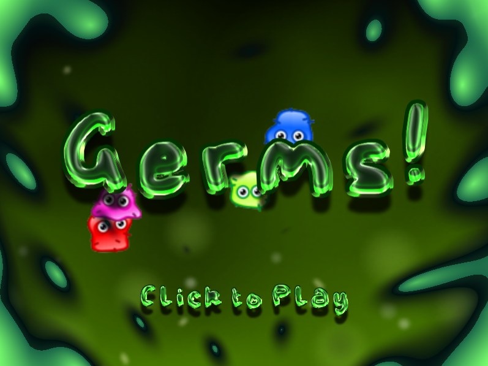

# Germs! — Avoid the Germs

A fast little arcade dodge-and-collect game built with [Phaser 3](https://phaser.io/) and [Vite](https://vitejs.dev/). Glide around a gooey petri dish, **avoid the germs**, and **collect the rings** to rack up a high score.



## Gameplay

- Move your cell with the **mouse** — it chases your pointer.
- **Collect rings** to increase your score.
- **Touch a germ** and it's game over.
- Beat your best run to set a **new high score** (kept for the session).

The animated, oozing background is a live GLSL "goo" shader running behind the action.

## Getting Started

### Prerequisites

- [Node.js](https://nodejs.org/) (which includes npm)

### Install

```bash
npm install
```

### Run the dev server

```bash
npm run dev
```

Then open the URL it prints (defaults to **http://localhost:3000**).

### Build for production

```bash
npm run build      # outputs to dist/
npm run preview    # serves the production build locally
```

## Controls

| Action           | Input          |
| ---------------- | -------------- |
| Move             | Move the mouse |
| Start / continue | Click          |

## Tech Stack

- **[Phaser 3.80](https://phaser.io/)** — game framework (Arcade Physics, atlases, bitmap fonts, tweens, GLSL shaders)
- **[Vite 5](https://vitejs.dev/)** — dev server and bundler

## Project Structure

```
.
├── index.html            # App entry point
├── vite.config.js        # Vite config (dev server on port 3000)
├── public/assets/        # Sprites, audio, fonts, goo.frag shader
└── src/
    ├── main.js           # Phaser game config & scene list
    ├── scenes/
    │   ├── Boot.js        # Initial boot
    │   ├── Preloader.js   # Loads assets & creates animations
    │   ├── MainMenu.js    # Title screen + goo shader
    │   └── MainGame.js    # Core gameplay loop & scoring
    └── entities/
        ├── Player.js      # Mouse-following player cell
        ├── Germ.js        # A single germ
        ├── Germs.js       # Germ spawner / group
        └── Pickups.js     # Collectible rings
```

## License

This project is provided as-is for learning and fun.
